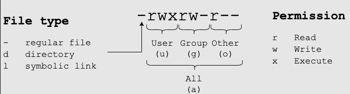

# File and Folder Permissions

Permissions of files and folders can be viewed using `ls -al`

```bash
/usr/testusrdir# ls -al

total 12
drwxr-xr-x  3 root root 4096 Nov  8 19:21 .
drwxr-xr-x 16 root root 4096 Nov  8 19:16 ..
drwxr-xr-x  2 root root 4096 Nov  8 19:21 subdirtest
lrwxrwxrwx  1 root root   10 Nov  8 21:05 symlink -> ./testfile
-rw-r--r--  1 root root    0 Nov  8 20:58 testfile
```

Explanation of information in each line: 



To make changes to permissions you can use the `chmod` command with either **octal** or **symbolic** notation. When Linux file permissions are represented by numbers, it's called numeric mode. In numeric mode, a three-digit value represents specific file permissions (for example, 744.) These are called octal values. The first digit is for owner permissions, the second digit is for group permissions, and the third is for other users. Each permission has a numeric value assigned to it:

|Permission |Octal|
|-----------|-----|
|r (read)   | 4   |
|w (write)  | 2   |
|x (execute)| 1   |


The numbers are representing binary positions in order of `rwx`:
|Permission|Binary|
|----------|------|
|r         | 100  |
|w         | 010  |
|x         | 001  |

In the permission value 744, the first digit corresponds to the user, the second digit to the group, and the third digit to others. By adding up the value of each user classification, you can find the file permissions.

For example, a file might have read, write, and execute permissions for its owner, and only read permission for all other users. That looks like this:

Owner: rwx = 4+2+1 = 7
Group: r-- = 4+0+0 = 4
Others: r-- = 4+0+0 = 4
The results produce the three-digit value 744.


| Octal digit | Permission(s) granted                         | Symbolic    |
|-------------|-----------------------------------------------|-------------|
| 0           | None                                          | [u/g/o]-rwx |
| 1           | Execute permission only                       | [u/g/o]=x   |
| 2           | Write permission only                         | [u/g/o]=w   |
| 3           | Write and execute permissions only: 2 + 1 = 3 | [u/g/o]=wx  |
| 4           | Read permission only                          | [u/g/o]=r   |
| 5           | Read and execute permissions only: 4 + 1 = 5  | [u/g/o]=rx  |
| 6           | Read and write permissions only: 4 + 2 = 6    | [u/g/o]=rw  |
| 7           | All permissions: 4 + 2 + 1 = 7                | [u/g/o]=rwx |

`sudo chmod 777 testfile` is the same as `sudo chmod u=rwx,g=rwx,o=rwx testfile` and the same as `sudo chmod a=rwx testfile`

all 3 of the above commands result in a file with the permissions: `-rwxrwxrwx  1 root root    0 Nov  8 20:58 testfile`

## File and Folder Ownership

`-rw-r--r--  1 root root    0 Nov  8 20:58 testfile`

In this case the user owner is root, and the group owner is root. To change user or group ownership, use the chown command: 

```bash
chown user:group file
```

Change ownership to the user "testuser", but remains with the root group: `-rw-r--r--  1 testuser root    0 Nov  8 20:58 testfile`
```bash
chown testuser testfile
```

Change the group ownership to "testgroup" to: `-rw-r--r--  1 testuser testgroup    0 Nov  8 20:58 testfile`
```bash
chown :testgroup testfile
```
Change the ownership back to the user root, and root group: `-rw-r--r--  1 root root    0 Nov  8 20:58 testfile`
```bash
chown root:root testfile
```
