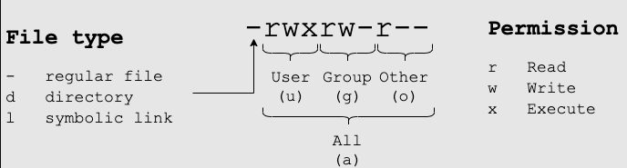

# File and Folder Permissions

Permissions of files and folders can be viewed using `ls -al`

```bash
/usr/testusrdir# ls -al

total 12
drwxr-xr-x  3 root root 4096 Nov  8 19:21 .
drwxr-xr-x 16 root root 4096 Nov  8 19:16 ..
drwxr-xr-x  2 root root 4096 Nov  8 19:21 subdirtest
lrwxrwxrwx  1 root root   10 Nov  8 21:05 symlink -> ./testfile
-rw-r--r--  1 root root    0 Nov  8 20:58 testfile
```

- `-a`: (All) Shows hidden files, any file that start with a `.` would be hidden by default. 
- `-l`: (Long) Shows a detailed list, includes more than just the filenames. Lists permission, owner, filesize, and date modified for each item. 

Explanation of information in each line:



```text
-rw-r--r--  1 root root    0 Nov  8 20:58 testfile
```

For the `testfile` line, the permission section has the following value: `-rw-r--r--`. 

- `-`: The initial dash means that `testfile` is a regular file, and not a directory or symbolic link. 
- `rw-`: The next 3 characters tell us that the user who owns the file (root) has both read and write permissions. 
- `r--`: These tell us that the group that owns the file (root) has only read access. 
- `r--`: The last 3 characters, specifying the permissions for others, show that only read access is given. 
- The first `root` tells us the user that owns the file, and the second `root` shows the group that has access to it. 
- The next column is the filesize, which since it is only a directory is small. 
- The last two columns are last modified date and filename. 

To make changes to permissions you can use the `chmod` command with either **octal** or **symbolic** notation. When Linux file permissions are represented by numbers, it's called numeric mode. In numeric mode, a three-digit value represents specific file permissions (for example, 744.) These are called octal values. The first digit is for owner permissions, the second digit is for group permissions, and the third is for other users. Each permission has a numeric value assigned to it:

|Permission |Octal|
|-----------|-----|
|r (read)   | 4   |
|w (write)  | 2   |
|x (execute)| 1   |

The numbers are representing binary positions in order of `rwx`:

|Permission|Binary|
|----------|------|
|r         | 100  |
|w         | 010  |
|x         | 001  |

In the permission value 744, the first digit corresponds to the user, the second digit to the group, and the third digit to others. By adding up the value of each user classification, you can find the file permissions.

For example, a file might have read, write, and execute permissions for its owner, and only read permission for all other users. That looks like this:

Owner: rwx = 4+2+1 = 7

Group: r-- = 4+0+0 = 4

Others: r-- = 4+0+0 = 4

The results produce the three-digit value 744.

| Octal digit | Permission(s) granted                         | Symbolic    |
|-------------|-----------------------------------------------|-------------|
| 0           | None                                          | [u/g/o]=rwx |
| 1           | Execute permission only                       | [u/g/o]=--x |
| 2           | Write permission only                         | [u/g/o]=-w- |
| 3           | Write and execute permissions only: 2 + 1 = 3 | [u/g/o]=-wx |
| 4           | Read permission only                          | [u/g/o]=r-- |
| 5           | Read and execute permissions only: 4 + 1 = 5  | [u/g/o]=r-x |
| 6           | Read and write permissions only: 4 + 2 = 6    | [u/g/o]=rw- |
| 7           | All permissions: 4 + 2 + 1 = 7                | [u/g/o]=rwx |

`sudo chmod 777 testfile` is the same as `sudo chmod u=rwx,g=rwx,o=rwx testfile`, and the same as `sudo chmod a=rwx testfile`.

All 3 of the above commands result in a file with the permissions:

`-rwxrwxrwx  1 root root    0 Nov  8 20:58 testfile`

Note that on enterprise-grade distributions like Red Hat or Fedora, you may find SELinux contexts and ACLs (Access Control Lists), which provide even more granular control beyond standard Unix permissions.

## Changing permission and ownership

Create a file to change permissions with. 

```bash
touch testfile
```

Run the following as a shortcut for `ls -l` to view the permissions on the file we just created. 

```bash
ll testfile
```

By default, the file has the following permissions:

`-rw-rw-r--`

This means that `pluser` has read and write permissions, and all others can only read the file. 

Then, add execute permissions for the user. 

```bash
chmod u+x testfile
```

Run `ll testfile` to view the change in permissions. 

Set the group permission to only `read`

```bash
chmod g=r testfile
```

Check that the permissions were properly updated. 

Add execute permissions for user, group, and others. 

```bash
chmod +x testfile
```

View the permission change with `ll testfile`. 

Next, create a folder named `testfolder`. 

```bash
mkdir testfolder
```

Move `testfile` into `testfolder`. 

```bash
mv testfile testfolder
```

To view the changes at the folder level

```bash
ll
```

And within the folder

```bash
ll testfolder
```

To be able to `cd` into a folder, you must have execute permissions on the folder. 

Remove execute permissions on `testfolder`. 

```bash
chmod -x testfolder
```

Now, try to enter the directory. 

```bash
cd testfolder
```

You will get an error saying `Permission denied`. 

Try to list the files in `testfolder`. 

```bash
ll testfolder
```

Since we don't have enough permission, very few details can be seen. 

```text
d????????? ? ? ? ?            ? ./
d????????? ? ? ? ?            ? ../
-????????? ? ? ? ?            ? testfile
```

Add execute permissions back to testfolder, and make sure that you can `cd testfolder` again. 

```bash
chmod +x testfolder
cd testfolder
cd ..
ll testfolder
```

So far, we've used `chmod` to change the permissions on files and folders. `chown` handles changing who owns the file or directory. 

Change the owner of `testfolder` to `ansibleuser`. 

```bash
chown -R ansibleuser: testfolder
```

- `-R`: (Recursive) This ensures that `ansibleuser` will be the owner of `testfolder`, as well as the owner of any items inside it (`testfile` in our case).
- `ansibleuser:`: This is a shortcut for `ansibleuser:ansibleuser`, which sets both the owner and primary group to `ansibleuser`. 

This will fail, saying the operation is not permitted. Linux does not allow regular users to give away ownership of their files. 

Run the command again with sudo to transfer the folder. 

```bash
sudo chown -R 1002:1002 testfolder
```

- `1002:1002`: These are the UID and GID's of `ansibleuser`. They can be seen in `cat /etc/passwd`. You can specify the numbers for users/groups instead of their names when changing ownership or permissions.  

Verify that the changes were completed. 

```bash
ll
ll testfolder
```

You will see that the owner and group columns have been updated from `pluser` to `ansibleuser`. 

## Setting permissions with octal values

As we saw before, permissions can be expressed as symbolic (rwx) as well as octal values (0-7). Each digit represents a sum: 4 (Read), 2 (Write), and 1 (Execute). 

The common permission values to use are:

- `400` (r--------): Owner can read only. Used for highly sensitive read-only files. 
- `600` (rw-------): Owner can read and write. This is the standard for `authorized_keys` and configuration files that contain private credentials.
- `640` (rw-r-----): Owner can read/write, and the group can read. Common for log files or shared configuration files. 
- `777` (rwxrwxrwx): Everyone can read, write, and execute. Usually only used for temporary shared folders or debugging; it should almost never be used in a production environment.

Knowing these permissions make common `chmod` commands much simpler. 

To set the permissions on testfile to (rw-r-----), to do so with symbolic notation:

```bash
touch permissions.txt
chmod u=rw,g=r,o= permissions.txt
```

And much simpler:

```bash
chmod 640 permissions.txt
```

## SSH key file permissions

SSH is extremely strict about file permissions. Keys must only be accessible by your user on your workstation, and SSH will refuse to use them if this is not the case. 

Run the following to view the permissions on the `.ssh` directory

```bash
ls -ld ~/.ssh
```

The output

```text
drwx------ 2 pluser pluser 4096 May  5 18:44 /home/pluser/.ssh
```

We can see that the `.ssh` directory can only be accessed by `pluser`. This means that no other user can access any files within your `.ssh` directory, which we want. 

To view the permissions of the ssh keys we created

```bash
ls -l ~/.ssh
```

The output

```text
-rw-rw-r-- 1 pluser pluser  181 May  5 18:41 config
-rw------- 1 pluser pluser  419 May  5 18:20 id_ed25519
-rw-r--r-- 1 pluser pluser  104 May  5 18:20 id_ed25519.pub
-rw------- 1 pluser pluser 2934 May  5 18:41 known_hosts
-rw------- 1 pluser pluser 2098 May  5 18:41 known_hosts.old
```

We care about the `id_ed25519` and `id_ed25519.pub` files. 

- `-rw-------` means that the private key can only be read and edited by `pluser`. 
- `-rw-r--r--` means that the public key can only be edited by `pluser`, and read by everyone. 

These permissions are strict to ensure that no other user is able to change either key file, or to read your private key. 

## Shared folder permissions

You will often need folders where multiple users can collaborate together. 

Let's see the problem that occurs if we try to do this with the permissions we've gone over so far. 

Create a folder where users would be able to collaborate in together, and assign the folder to the `courseadmin` group. 

```bash
mkdir groupfolder
chown :courseadmin groupfolder/
ls -l
```

The output below shows that `groupfolder` was created, and was assigned to `courseadmin`. 

```text
total 4
drwxrwxr-x 2 pluser courseadmin 4096 May  8 19:43 groupfolder
```

Create a file within `groupfolder`. 

```bash
touch groupfolder/myfile
ll groupfolder/
```

However, even though the file was created within a folder assigned to `courseadmin`, the file is still owned by only `pluser`, and not `courseadmin`. 

```text
total 8
drwxrwxr-x 2 pluser courseadmin 4096 May  8 15:37 ./
drwxr-x--- 5 pluser pluser      4096 May  8 15:37 ../
-rw-rw-r-- 1 pluser pluser         0 May  8 15:37 myfile
```

To solve this, run the following command. 

```bash
chmod g+s groupfolder
ls -l
```

Looking at the output, we can see the within the permissions there is an `s` in the execute location of the group permissions for the folder. 

```bash
total 4
drwxrwsr-x 2 pluser courseadmin 4096 May  8 19:46 groupfolder
```

Now, create another file within `groupfolder`. 

```bash
touch groupfolder/groupfile
ls -l groupfolder/
```

After the permission change, the newly created file is now assigned to `courseadmin`, as we intended. 

```text
total 0
-rw-rw-r-- 1 pluser courseadmin 0 May  8 19:53 groupfile
-rw-rw-r-- 1 pluser pluser      0 May  8 19:46 myfile
```
